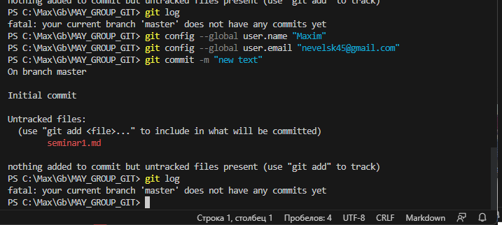

# Туториал по основам версий
# Туториал по основам версий git

```
# Инструкция-туториал по работе с Markdown

## Заголовки

# First level header
## Second level header
### Third level header
#### Fourth level header
##### Fifth level header
###### Sixth level header

## Исходный код

numb_a = input("Enter a number from 1 to 99: ")
if ((numb_a >= 1) and (numb_a =< 99)):
    print("Hello world")
else
    print("Incorrect input")


## Таблицы

First Header | Second Header
------------- | -------------
Content Cell | Content Cell

Для красоты можно и по бокам линии нарисовать:

| First Header | Second Header |
| ------------- | ------------- |
| Content Cell | Content Cell |
| Content Cell | Content Cell |


## Изображения

**Чтобы добавить изображения, воспользуйтесь следующей командой:**

```



`````